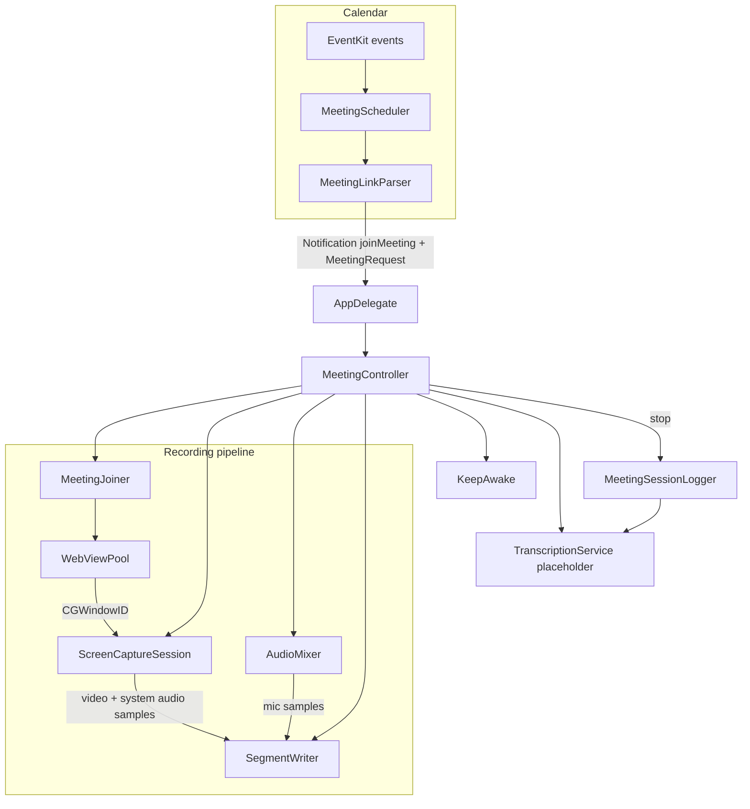

# MeetScribe

Source: [github.com/Dineshachari/callmet](https://github.com/Dineshachari/callmet) (repo name **callmet**).

## What this is

**MeetScribe** is a native **macOS** menu bar app for people who want a **local recording** of video calls without juggling separate “join in browser + OBS” setups. It:

- Reads your **Calendar** (EventKit) for the next day or so and looks for **Google Meet**, **Zoom**, and **Microsoft Teams** links in the event URL, location, or notes.
- **Joins** the meeting inside the app in a dedicated **WKWebView** window (WebKit, not Chrome).
- **Captures** that window with **ScreenCaptureKit** (video + **system audio** from the capture pipeline) and **mixes in your microphone**.
- Writes a single **`.mov`** (H.264 video, AAC for system + mic) into a folder you choose, plus a **text session log** next to it.

Scheduled runs fire **two minutes before** the calendar start time. You can also **paste a link** from the menu for ad-hoc joins. **Transcription** is stubbed for a future Whisper-style step; paths are stored for later processing.

## Features (quick scan)

| Area | Behavior |
|------|----------|
| **Scheduling** | `MeetingScheduler` + `MeetingLinkParser`; `joinMeeting` notification |
| **Join** | Bundled `join_meet.js` / `join_zoom.js`; bot name from `BotSettingsStore` |
| **Capture** | Window-targeted `SCStream` at 1280×720, 24 fps + stream audio |
| **Mux** | `AVAssetWriter` in `SegmentWriter` (stereo system AAC, mono mic AAC) |
| **UX** | Menu bar status, recording timer/pulse, permissions onboarding |
| **Persistence** | Output folder + bot name in app storage; login item when built as `.app` (`SMAppService`) |

## Architecture (high level)



## End-to-end flow (runtime)

1. **`MeetingScheduler`** queries **EventKit** for events in a forward window, extracts conference URLs with **`MeetingLinkParser`**, and posts **`joinMeeting`** carrying a **`MeetingRequest`** **two minutes** before the event starts, then reschedules.
2. **`AppDelegate`** observes **`joinMeeting`** and forwards the request to **`MeetingController`**. The same path is used for **“Join Meeting Link…”** (manual `MeetingRequest`).
3. **`MeetingController.startRecording`** checks **`Permissions`**, starts **`KeepAwake`**, and **`MeetingJoiner`** loads the URL in **`WebViewPool`**, injects the right join script (with **`__MEETSCRIBE_BOT_NAME__`** substituted), and returns the meet window’s **`CGWindowID`**.
4. **`ScreenCaptureSession`** builds an **`SCContentFilter`** for that window and runs **`SCStream`**, forwarding video and capture-stream audio into **`SegmentWriter`**.
5. **`AudioMixer`** captures the **microphone** and appends AAC-bound mic samples to the same writer.
6. **`SegmentWriter`** muxes everything into **`meetscribe-<UUID>.mov`** under the configured output directory.
7. On stop, **`MeetingSessionLogger`** writes **`meetscribe-<UUID>.txt`** (session metadata). **`TranscriptionService`** records paths for optional future transcription (placeholder when the system is under thermal / Low Power pressure).

## Outputs

- **Video:** `<output-folder>/meetscribe-<UUID>.mov`
- **Log:** same basename, **`.txt`** — meeting name, URL, bot name, source (scheduled vs manual), timestamps, duration, and file reference.

## Using the app

- **Start / Stop Monitoring** — turns calendar polling on or off (menu title toggles).
- **Join Meeting Link…** — paste Meet / Zoom / Teams text or URL; optional display name for logs.
- **Choose Output Folder…** / **Open Output Folder** — where `.mov` and `.txt` files go.
- **Bot Display Name…** — name injected into join scripts (what others may see in the meeting UI).
- **Grant Permissions…** / **Open Screen Recording Settings…** / **Permission Diagnostics…** — TCC helpers; macOS often requires **full quit and relaunch** after enabling Screen Recording.

## How the code is organized

| File / type | Role |
|-------------|------|
| **`MeetScribeApp.swift`** | SwiftUI `@main` entry; **`AppDelegate`** status item menu, **`MeetingScheduler`** lifecycle, **`NotificationCenter`** for **`joinMeeting`**, **`captureStarted`**, **`captureStopped`**, recording indicator, permission UI. |
| **`MeetingController.swift`** | One active session: **`MeetingJoiner`**, **`SegmentWriter`**, **`AudioMixer`**, **`ScreenCaptureSession`**, **`isRecording`**, stop/finish, transcription scheduling. |
| **`MeetingJoiner.swift`** | **`WebViewPool`**, URL load, script injection, Meet state polling, **`CGWindowID`**. |
| **`WebViewPool.swift`** | Borderless **`NSWindow`** + **`WKWebView`** (desktop UA, autoplay), **`windowID`**. |
| **`ScreenCaptureSession.swift`** | **`SCShareableContent`** by window ID, **`SCStream`** → **`onVideo`** / **`onAudio`**. |
| **`SegmentWriter.swift`** | **`AVAssetWriter`**: H.264 1280×720, stereo AAC system, mono AAC mic; serial queue. |
| **`AudioMixer.swift`** | Mic → **`onBuffer`** → writer. |
| **`MeetingScheduler.swift`** | **`EKEventStore`**, events predicate, link parsing, pre-start timer. |
| **`MeetingLinkParser.swift`** | Meet / Zoom / Teams URL extraction (calendar + paste). |
| **`MeetingRequest.swift`** | URL, display name, optional start, **scheduled** vs **manual**. |
| **`Permissions.swift`** | Calendar, mic, screen recording; snapshots; “relaunch likely” hints. |
| **`OutputFolderStore.swift`** | Saved recordings directory. |
| **`BotSettingsStore.swift`** | Saved bot display name. |
| **`KeepAwake.swift`** | Display sleep suppression while recording. |
| **`MeetingSessionLogger.swift`** | Sidecar **`.txt`** after each session. |
| **`TranscriptionService.swift`** | **`UserDefaults`** paths; placeholder async transcription hook. |
| **`Package.swift`** | SwiftPM executable **MeetScribe**, macOS 14+, **`Resources/Assets`**. |

Unit tests (e.g. **`MeetingLinkParserTests`**) live under **`Tests/MeetScribeTests/`**.

## Internal notifications (for contributors)

| Name | Posted by | Purpose |
|------|-------------|---------|
| **`joinMeeting`** | `MeetingScheduler` | `object` is a **`MeetingRequest`** |
| **`captureStarted`** | `MeetingController` | Recording pipeline is live |
| **`captureStopped`** | `MeetingController` (and error path in `handle`) | Capture ended or failed early |

## Requirements

- **macOS 14+**
- **Xcode** (or Swift 5.10+) for local builds
- **Google Chrome** is *not* required; join + playback use **WebKit** inside the app.
- **Privacy**: **Calendar**, **Microphone**, and **Screen Recording** for scheduled joins and capture.

## Building

**Swift Package Manager**

```bash
swift build
swift run MeetScribe
```

**Xcode**

1. Open **`MeetScribe.xcodeproj`**.
2. Run the **MeetScribe** scheme on **My Mac**.

For distribution as an **`.app`**, use your archive / notarization flow; **`AppDelegate`** registers a login item via **`SMAppService`** when the bundle is an app.

## License

Add a **`LICENSE`** file when you publish; none is asserted here by default.

## Contributing

Issues and pull requests are welcome. For bugs, include **macOS version**, **MeetScribe build**, and whether the failure is join, permissions, or capture-related.
